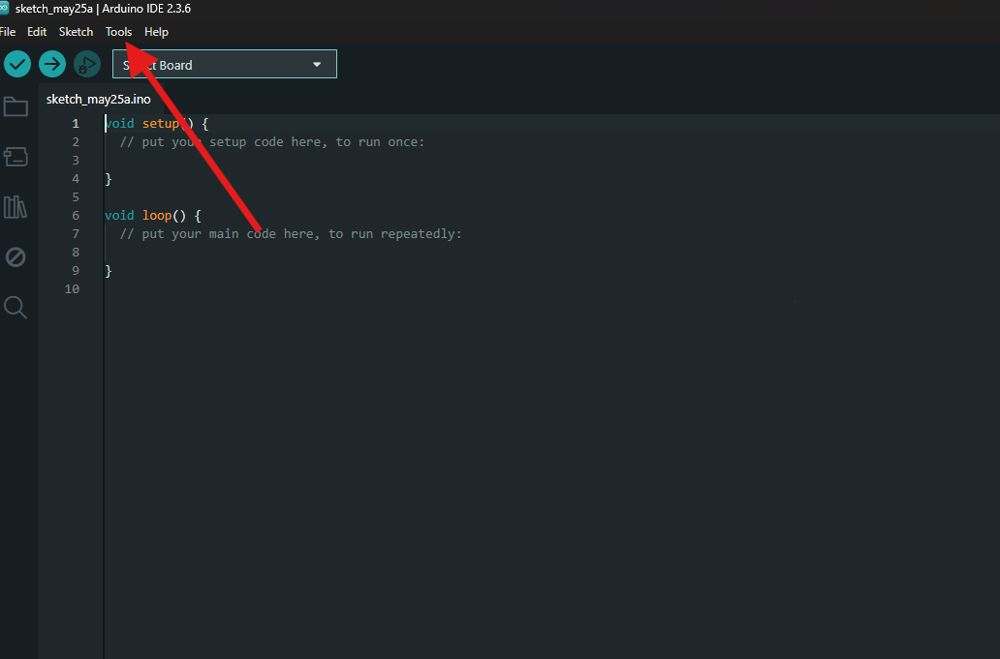
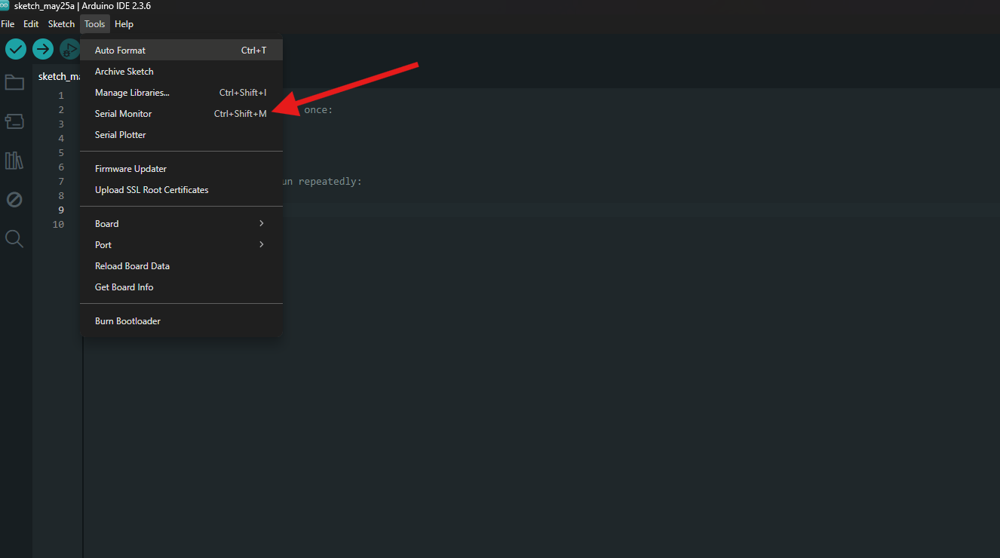
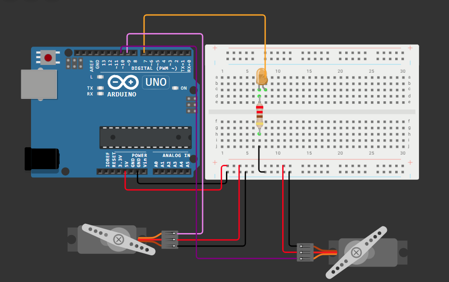
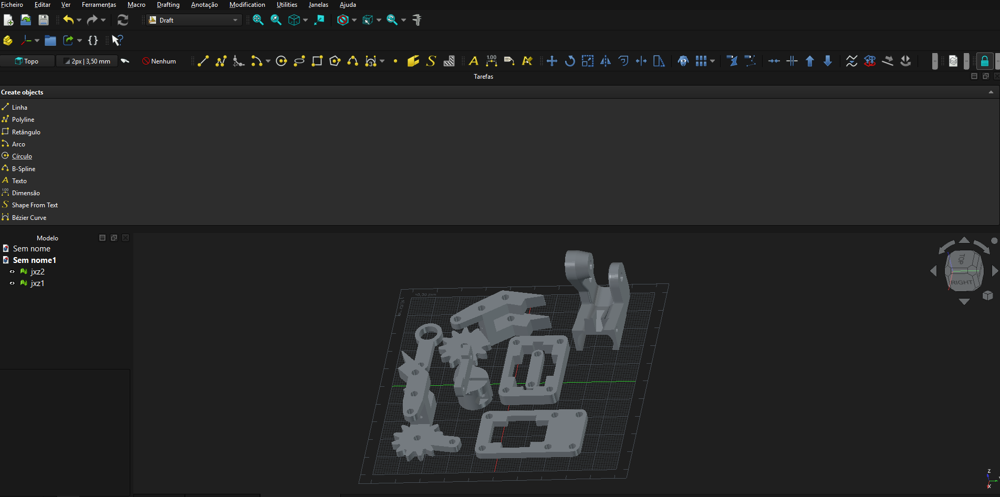

# 🦾 Braço Robótico de Coleta de Amostras — Docking & Retrieval

> Projeto de manipulação de carga em ambiente de microgravidade, controlado via Monitor Serial do Arduino.

---

## 👥 Integrantes

| Nome | RM |
|---|---|
| Levy Nascimento Junior | RM98655 |
| Luiza Cristina Silva | RM99367 |
| Rafael Autieri dos Anjos | RM550885 |
| Rafael Carvalho Mattos | RM99874 |

---

## 🔗 Simulador

Acesse o circuito simulado no Wokwi :
**[https://wokwi.com/projects/465562486531688449](https://wokwi.com/projects/465562486531688449)**

---

## ⚙️ Especificações Técnicas

| Componente | Detalhe |
|---|---|
| Microcontrolador | Arduino Uno |
| Servomotor 1 (Articulação) | Pino Digital **9** |
| Servomotor 2 (Garra) | Pino Digital **10** |
| LED de Status | Pino Digital **13** |
| Tensão da Fonte | **5V** (fonte de bancada do simulador) |

---

## 🛠️ Como Operar o Braço Robótico

### 1. Abrir o Monitor Serial

1. Abra o **Arduino IDE**
2. Conecte o Arduino Uno via USB
3. Vá em **Ferramentas → Monitor Serial** (ou pressione `Ctrl + Shift + M`)
4. Configure o **baud rate para `9600`** no canto inferior direito do Monitor Serial
5. Certifique-se de que a opção de envio está em **"Sem terminador"** ou **"Nova linha"**

### 2. Comandos Disponíveis

Digite o comando no campo de texto do Monitor Serial e pressione **Enter** (ou clique em **Enviar**):

| Comando | Ação | Descrição |
|---|---|---|
| `U` | **Up** — Braço Sobe | Move a articulação principal para cima (servo 1 → 0°) |
| `D` | **Down** — Braço Desce | Move a articulação principal para baixo (servo 1 → 90°) |
| `O` | **Open** — Garra Abre | Abre a garra para capturar a amostra (servo 2 → 0°) |
| `C` | **Close** — Garra Fecha | Fecha a garra para segurar a amostra (servo 2 → 90°) |

O **LED de status** acende sempre que um comando é recebido e executado com sucesso.

#### Acredito que já possuem o Arduino IDE baixado, partindo deste ponto basta clicar em: Ferramentas > Monitor Serial ou com o atalho Ctrl+Shift+M

---

## 🖨️ Modelagem 3D

- **Software utilizado:**  FreeCad
- **Peça modelada:** Garra (Grip) do braço robótico
- A garra foi projetada com variáveis paramétricas para permitir ajuste de tamanho e compatibilidade com **servomotores de 9g**

---

## 🖼️ Imagens

### Circuito no Simulador (Wokwi)

### Modelo 3D da Garra (FreeCAD)

---

## 🚀 Contexto do Projeto

Este projeto simula um **braço robótico de coleta de amostras** inspirado em missões espaciais de *Docking & Retrieval*. O braço é projetado para operar em ambientes de **microgravidade**, onde a precisão dos movimentos e a confiabilidade do sistema de captura são essenciais para o sucesso da missão.

A garra foi desenvolvida considerando as particularidades da indústria espacial: leveza, encaixe preciso para servomotores de 9g e design funcional para manipulação de amostras em condições adversas.